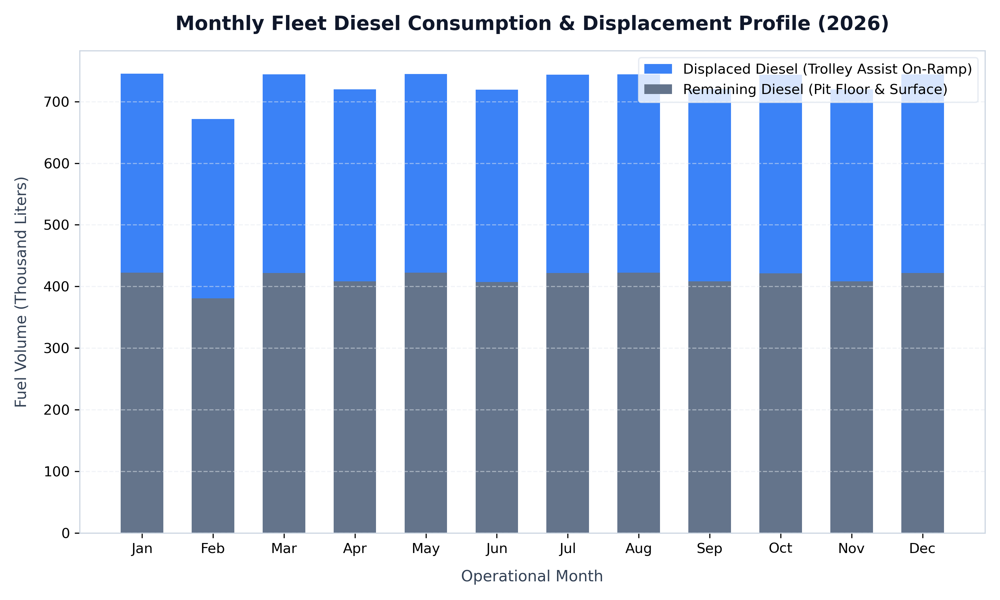
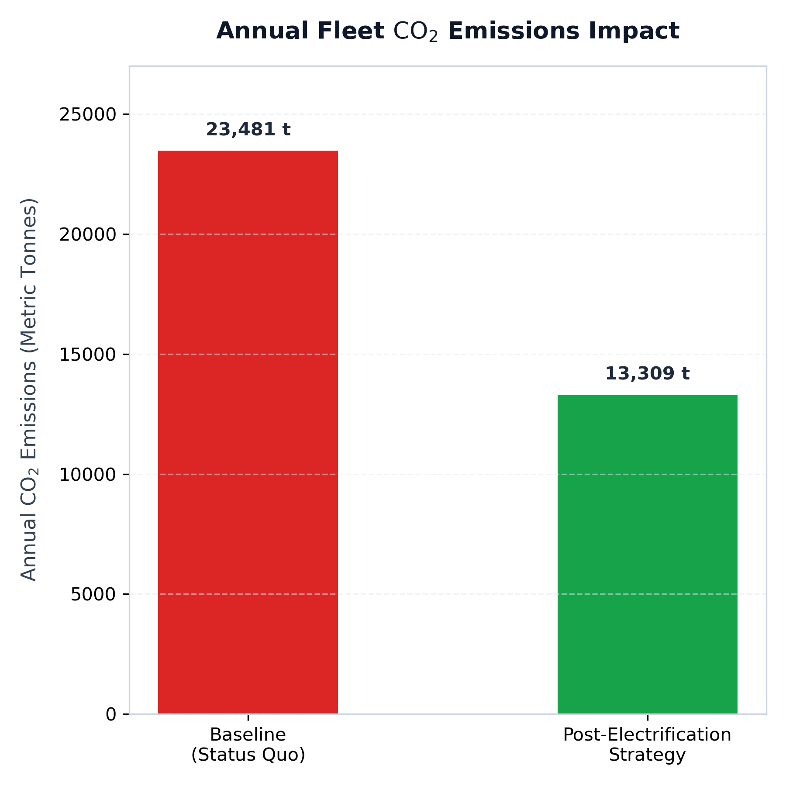

# Project Horizon: Mining Fleet Hybrid Electrification Framework
An institutional-grade engineering and financial optimization model assessing the operational deployment of an infrastructure-backed **Hybrid Trolley Assist network** for a 40-truck haulage fleet (CAT 793 equivalents).

---

## 📌 Executive Summary
Project Horizon evaluates the strategic transition of a heavy surface mining operation away from traditional fossil-fuel-intensive haulage profiles to a high-voltage overhead DC grid topology. 

The strategy focuses on **Ramp Electrification**. While the main haulage ramp constitutes roughly **15%** of the physical track length, it accounts for **~40%** of aggregate fleet fuel burn due to the massive torque required to lift a 250-tonne payload against gravity. By installing trolley assist lines on the vertical ascent, the operation eliminates millions of liters of diesel, capitalizes on a 3x electric motor thermodynamic efficiency gain, and mitigates substantial carbon tax exposure.

---

## 📊 Presentation Deliverables
The complete strategy deck detailing the engineering metrics, project layout, and financial sensitivity matrix is available below:

👉 **[View Project Horizon Strategy Presentation (PDF)](https://github.com/user-attachments/files/29778559/PROJECT.HORIZON.PHASE.1.pdf)
**

---

## 📂 Repository Architecture
All core model systems are deployed cleanly at the root level of the workspace:
* `app.py`: High-fidelity interactive web dashboard powered by **Streamlit** and **Plotly** for real-time executive scenario testing.
* `haul_cycle_simulator.py`: Synthetic telemetry generation engine compiling second-by-second mechanical logs (146,000+ distinct haul cycles).
* `fleet_analytics_pipeline.py`: Automated operational data pipeline executing mass-balance emissions arithmetic.
* `generate_plots.py`: Analytical scripting model exporting publication-ready operational visualizations.
* `Project_Data.xlsx`: Master spreadsheet containing core baseline operational metrics.
* `pipeline_summary_output.txt`: Raw ledger output documenting baseline fleet footprint vs strategic abated volume.
* `monthly_diesel_displacement.png`: Stacked-bar fuel profiling asset across the 12-month timeline.
* `co2_emissions_comparison.png`: Executive before-and-after greenhouse gas reduction metric display.

---

## 🎛️ Architecture Breakdowns

### Phase 1: Operational Base & Engineering Principles
Phase 1 establishes the mathematical engine, thermodynamic equivalents, and mass-balance logic underpinning the asset framework.
* **The Baseline Fleet:** 40 Haul trucks consuming an average of 500,000 Liters of diesel per year ($N = 40$, Totaling 20,000,000L).
* **Thermodynamic Equivalence Loop:** The model converts displaced diesel volume directly into a localized electrical utility grid load based on a foundational standard:
  $$\text{Energy Required (kWh)} = \frac{\text{Displaced Diesel (L)} \times 10\text{ kWh/L}}{\text{EV Efficiency Multiplier (3.0)}}$$
* **The Efficiency Advantage:** Electric drivetrains operate at a 3x mechanical performance multiplier over internal combustion engines during sustained torque cycles, meaning 10 kWh of diesel energy is replaced by only 3.33 kWh of electrical grid energy.

### Phase 2: Telemetry Data Pipeline & Digital Dashboard
Phase 2 shifts the model from static averages into a fully responsive, data-driven framework fed by an operational telemetry simulator.
1. **Telemetry Simulation (`haul_cycle_simulator.py`):** Compiles a 365-day operational ledger tracking variable shift consumption weights across the Pit Floor, Ramp Climb, and Surface zones.
2. **Data Processing (`fleet_analytics_pipeline.py`):** Aggregates millions of data rows, calculating exact carbon metrics using the international standard diesel factor ($2.68 \text{ kg } CO_2 \text{ per Liter}$).
3. **Interactive Visualizations (`app.py`):** An executive workspace providing sliders to dynamically adjust:
   * Projected Carbon Tax ($0 to $250 / Tonne)
   * Commercial Diesel Costs ($0.50 to $2.50 / Liter)
   * Grid Electricity Tariffs ($0.02 to $3.10 / kWh)
   * Infrastructure Length Variables (km)

---

## 📈 Visual Analytics & Analytical Profiles

### Fleet Fuel Displacement Profile
The monthly breakdown below charts the displacement of ramp-bound haulage diesel directly into a balanced commercial electrical grid network utility demand profile:



### Annual Carbon Footprint Abatement Impact
The following profile presents the dramatic systemic drop in greenhouse gas emissions from baseline diesel execution to full overhead trolley line strategy utilization:



---

## 📈 Executive Metrics & Insights

Running the data pipeline across the baseline configuration yields the following insights:
* **Displaced Ramp Diesel:** 8,000,000 Liters eliminated from variable operating expenses annually.
* **Gross Diesel Savings:** $9,600,000 / Year (at $1.20/L baseline benchmark).
* **Carbon Penalties Avoided:** $2,144,000 / Year in regulatory tax protections (21,440 Tonnes of CO2 abated at $100/t).
* **Net Annual OpEx Savings:** **$9,077,333 / Year** (accounting for $2.67M in new electricity utility overhead).

---

## 🚀 Execution & Deployment Instructions

### 1. Re-Run the Simulation Pipeline
To generate a brand new, high-fidelity `mine_fleet_telemetry.csv` file from the raw operational physics engine, execute:
```bash
python3 haul_cycle_simulator.py

```

### 2. View Raw Text Analytics Summaries

To aggregate the telemetry ledger and print the final mass-balance financial balances into your workspace directory, execute:

```bash
python3 fleet_analytics_pipeline.py

```

### 3. Launch the Web Analytics Dashboard

To initialize the Plotly graphic server interface and interact with the parameters live inside your web browser, execute:

```bash
pip install streamlit plotly pandas matplotlib
streamlit run app.py

```

---

🔒 *Project Horizon is an independent technical framework developed for professional-grade advisory validation and engineering portfolio review.*

```
